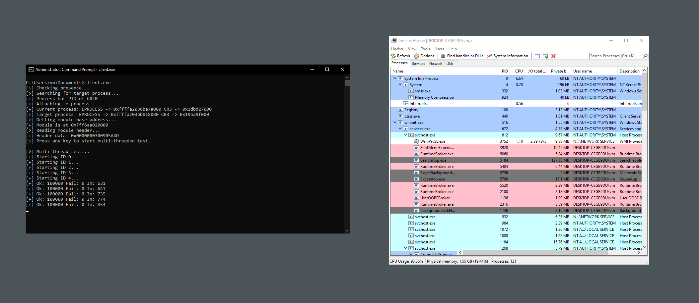

    
    <h3 align="center">memhv</h3>
    
<i>Minimalistic hypervisor with memory introspection capabilities</i>

## About
This project has a single goal: to be as minimal as possible while providing a hypercall API for reading/writing an address space of any (protected) process. It is a standalone Microsoft Windows kernel-mode driver that can be loaded either normally or through manual mapping.

## Support
- Windows 10 or Windows 11 (both 64-bit, tested on 22H2 and 24H2)
- AMD processor with SVM and NPT support

## Usage
1. Ensure that you have SVM enabled in UEFI firmware options (BIOS)
2. Make sure Microsoft Hyper-V is fully disabled
3. Sign and load the driver or use other means to load it ([kdmapper](https://github.com/TheCruZ/kdmapper), [KDU](https://github.com/hfiref0x/KDU), **make sure PE headers are not erased** if you want the hypervisor to use NPT to hide its memory from guest)
4. Enjoy hypercall API (see client folder)

## Detection vectors
Common timing attacks are ineffective against this hypervisor, as it does not exit on CPUID or similar instructions typically used in such attacks. Memory of the hypervisor is hidden from the guest using NPT.

## Credits
- [SimpleSvm](https://github.com/tandasat/SimpleSvm) by @tandasat
